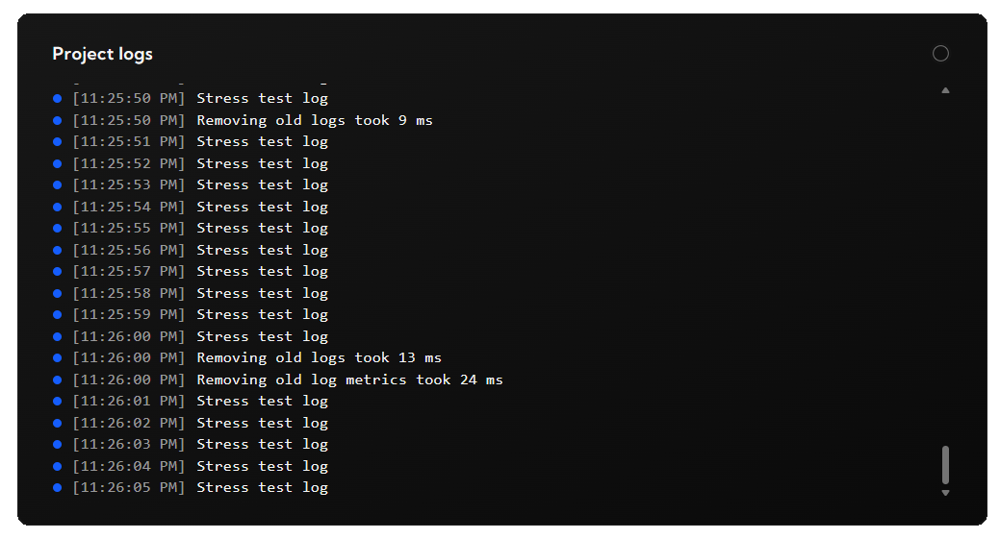
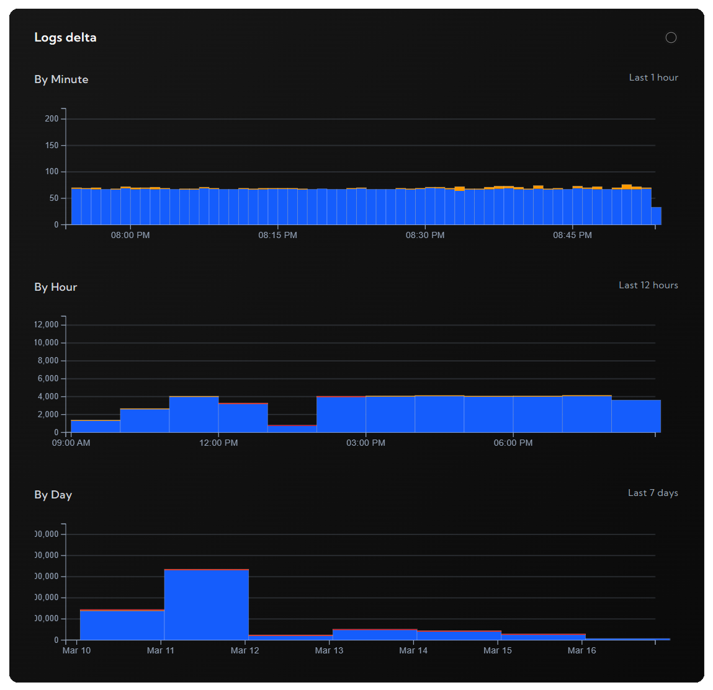

# logdash - RUST SDK

Logdash is a zero-config observability platform. This package serves an rust interface to use it.

## Pre-requisites

Setup your free project in less than 2 minutes at [logdash.io](https://logdash.io/)

## Installation

```
cargo add logdash
```

## Logging

```rust
let (logger, _) = logdash::create_logdash(logdash::Config::default());

// Send an info log message
logger.info("Rust SDK example");
```

## Metrics

```rust
let (_, metrics) = logdash::create_logdash(logdash::Config::default());

// create a metric
metrics.set("user".into(), 0.0)
// update the metric
metrics.mutate("user".into(), 1.0)
```

## View

To see the logs or metrics, go to your project dashboard




## Configuration

| Parameter | Required | Default | Description                                                                                                              |
| --------- | -------- | ------- | ------------------------------------------------------------------------------------------------------------------------ |
| `apiKey`  | no       | -       | Api key used to authorize against logdash servers. If you don't provide one, logs will be logged into local console only |
| `host`    | no       | -       | Custom API host, useful with self-hosted instances                                                                       |
| `verbose` | no       | -       | Useful for debugging purposes                                                                                            |

## License

This project is licensed under the MIT License.

## Contributing

Contributions are welcome! Feel free to open issues or submit pull requests.

## Support

If you encounter any issues, please open an issue on GitHub or let us know at [contact@logdash.io](mailto:contact@logdash.io).
